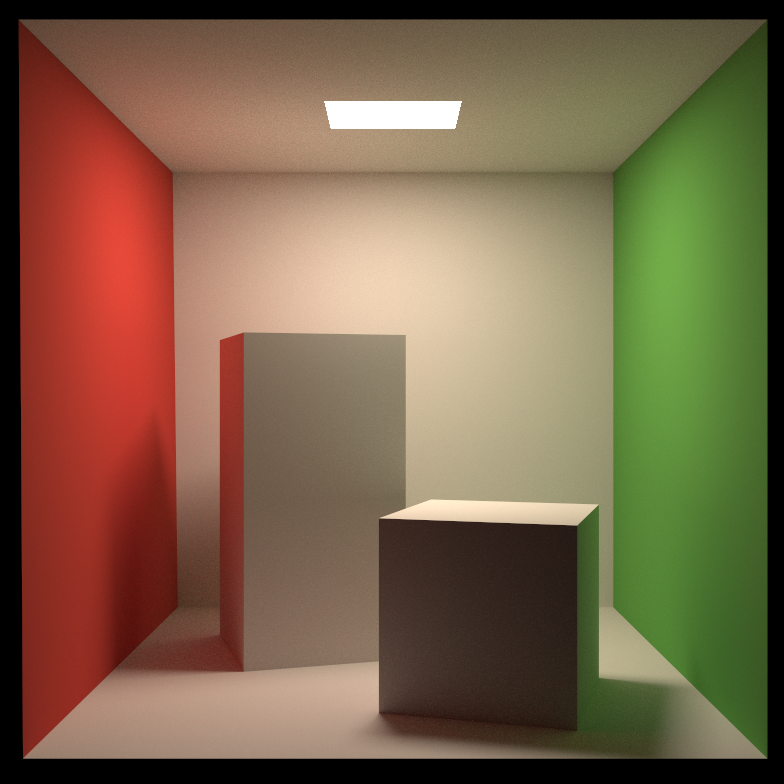

# CGZoo

实现部分经典算法的核心部分

## 介绍

## 路径追踪

- 网格加载
- gamma校正
- 光源均匀采样
- Sobol采样
- BVH加速
- 线程加速
- 渲染方程
- 漫反射BSDF
- 蒙特卡洛积分
- 射线-包围盒相交
- 射线-三角形相交

实现：[path_tracing](path_tracing.cpp)

## Bresenham算法画直线

实现：[line_draw](line_draw.cpp)

## gamma校正

实现：[gamma](gamma.cpp)

## 单点透视

实现：[perspective_cube](perspective_cube.cpp)

## SutherlandHodgman裁剪算法

实现：[SutherlandHodgman](SutherlandHodgman.cpp)

## 扫描线算法

实现：[scan_line](scan_line.cpp)

## 简单ray casting

- 光线透射
- 三角形求交
- 阴影
- 经验模型着色
- 透视
- 重心坐标插值

实现：[ray_casting_renderer](ray_casting_renderer.cpp)

## 简单光栅化

相比于光线透射，在三角形交接处有更多的锯齿，这可能是由于采样时的浮点舍入导致

- 透视正确插值
- 深度测试
- 重心坐标插值
- 经验着色模型

实现：[rasterization_renderer](rasterization_renderer.cpp)

## 简单软光栅

- 透视变换
- 齐次裁剪算法
- 多边形分割
- 重心坐标插值
- 透视正确插值
- 片元深度测试
- gamma校正
- 多线程加速

实现：[rendering_pipeline](rendering_pipeline.cpp)

